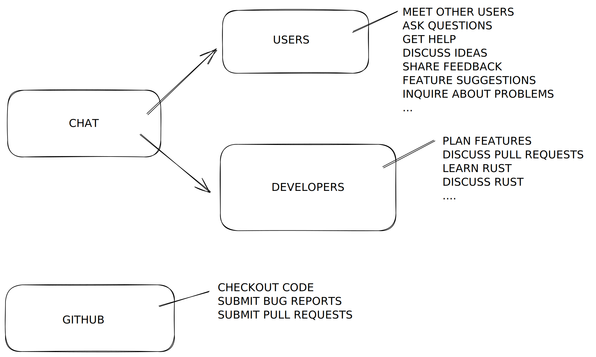

# 🔊 Discord Chat

Jet has a free chat instance on Discord, which is a great place for idea discussion and Q\&A.&#x20;

[<mark style="background-color:green;">**Click here to join!**</mark>](https://discord.gg/mu5DCPGJJq)

Discord uses either a free [desktop](https://discord.com/download) or a mobile app that you can download from your mobile app store.

## Why Join Chat?

Our community workflow is mostly based around Discord and [Substack](blog-and-announcements.md) and uses GitHub only to store the code, manage tickets, and pull requests. Discord is not just for casual chat -- it's our community hub -- you can read the (a bit long, sorry) explanation of this on [Contributing](contributing.md).

There is _intentionally_ no email discussion list and we're not on social media. We could have used email for planning and questions, but that approach seemed a bit dated and often people to not want to subscribe to high-traffic groups. We could have used Slack, but joining and flipping between Slack channels is often confusing.&#x20;

Discord works well for us and is increasingly used for more and more software projects.&#x20;

For asynchronous and more curated information, please also join the [free substack](blog-and-announcements.md) newsletter.

## Rules

We have just a few rules for Discord:

1. Be nice to each other.
2. Do not promote your products, projects, and services.
3. Our Discord is a meant to be a fun, casual channel for prospective users and those interested in directly using or working on the project _only_. For curious professional management tool developers and business employees involved in applications that could be viewed as ecosystem alternatives to Jet, this is _not_ an appropriate channel for you. We recommend following the [Substack](blog-and-announcements.md), which will have frequent detailed updates and all release information.

## Additional Chat Tips

1. Public pastebins, like gist.github.com, are often really helpful to see playbooks or ideas in context, without trying to format them from inside the Discord interface.  It's also possible to allow comments on gists, which can be really useful in correcting playbook content.&#x20;
2. If you think you've found a problem, descriptive language is always better than saying something doesn't work. Showing the command line used and relevant portions of output is also very helpful. This same tip goes for GitHub tickets as well.  Avoid flooding the channel though, so again, pastebins are helpful. For talking about some details, screenshots are also welcome, but they don't make copy-and-paste easy.
3. While not a rule, if you'd like to privately message someone on Discord, you can make message requests without using the Discord's "Friends List" feature. Friends List requests might be cancelled, and we don't want to seem unfriendly, so we are just passing that along here first!
4. We work for GIFs and emojis!  Not kidding.

&#x20; &#x20;

